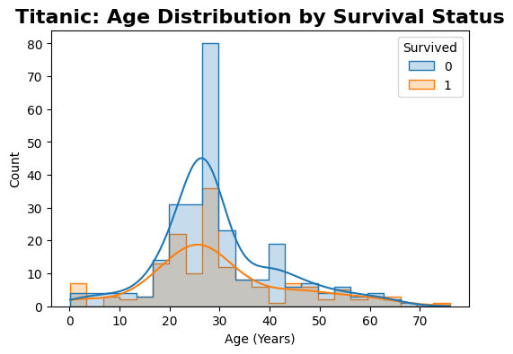
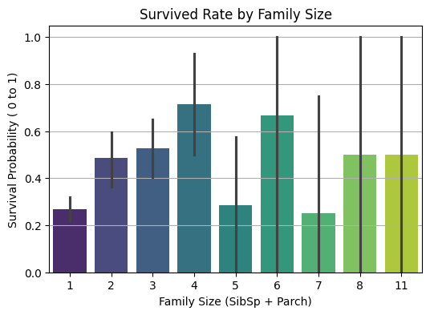

# 🚢 Titanic Data Analysis

My first Data Analysis project using Python! I analyzed the Titanic dataset to understand survival patterns.

## 📊 Key Insights
- **Age Factor:** Used Median Imputation to handle missing data.
- **Survival Patterns:** Discovered that young adults (male) were the most impacted group.
- **Family Size:** Analyzed how family size affected survival chances.

## 📈 Data Visualizations
### 1. Age Distribution by Survival Status

### 2. Survived Rate by Family Size

## 🛠️ Tech Stack
- Python, Pandas, Seaborn, Matplotlib

## 📂 Project Structure
- `titanic_data.py`: Main Python script for analysis.
- `titanic.csv`: The dataset used.
